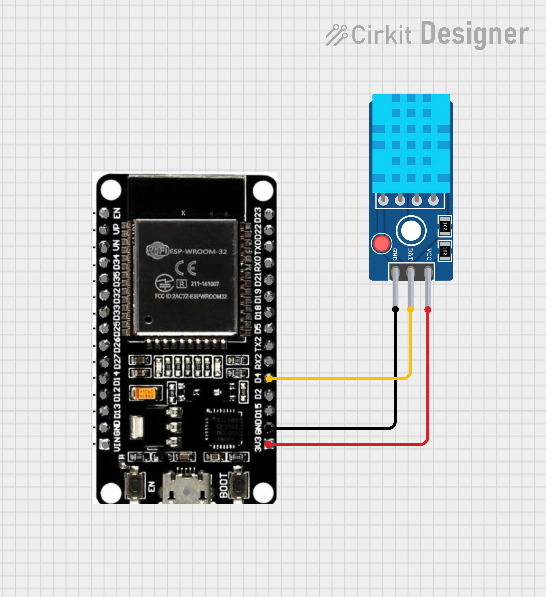

# 🌡️ Code 01 — Temperature Monitoring via MQTT

> Publish real-time temperature readings from a **DHT11 sensor** to an MQTT broker using **ESP32**.

---

## 📖 Description

This is the **first exercise** in the workshop. It introduces the fundamentals of IoT communication by reading temperature data from a DHT11 sensor and publishing it to an MQTT topic. You can visualize the data using **Node-RED** or any MQTT client.

---

## 🔧 What You'll Learn

- ✅ Connecting ESP32 to a Wi-Fi network
- ✅ Reading temperature from a DHT11 sensor
- ✅ Publishing sensor data to an MQTT broker
- ✅ Using Serial Monitor for debugging

---

## 📡 MQTT Details

| Property             | Value                      |
| -------------------- | -------------------------- |
| **Broker**           | `test.mosquitto.org`       |
| **Port**             | `1883`                     |
| **Publish Topic**    | `home/temperature`         |
| **Payload Format**   | Plain text (e.g., `25.50`) |
| **Publish Interval** | Every 5 seconds            |

---

## 🔌 Circuit Diagram

<p align="center">
  
</p>

```
ESP32          DHT11
──────         ─────
3.3V  ───────  VCC
GND   ───────  GND
GPIO4 ───────  DATA
```

> 💡 Some DHT11 modules have a built-in pull-up resistor. If using a bare sensor, add a **10kΩ pull-up resistor** between DATA and VCC.

---

## ⚙️ Configuration

Before uploading, update these values in `code01.ino`:

```cpp
const char* ssid = "YOUR_WIFI";          // Your Wi-Fi SSID
const char* password = "YOUR_PASSWORD";   // Your Wi-Fi password
const char* mqtt_server = "test.mosquitto.org";  // MQTT broker address
```

---

## 🚀 How to Use

1. Wire the DHT11 sensor to the ESP32 as shown above
2. Open `code01.ino` in Arduino IDE
3. Update Wi-Fi and MQTT credentials
4. Upload to ESP32
5. Open **Serial Monitor** (baud rate: `115200`) to see temperature readings
6. Subscribe to `home/temperature` in Node-RED or an MQTT client to see the data

---

## 🔗 Node-RED Integration

Add an **MQTT In** node in Node-RED:

- **Server:** `test.mosquitto.org:1883`
- **Topic:** `home/temperature`

Connect it to a **Dashboard Gauge** or **Chart** node to visualize the temperature!

### 📊 Serial Monitor Output

<p align="center">
  
</p>

> The Serial Monitor shows the temperature values being published to the MQTT broker in real time.

---

## 📦 Required Libraries

| Library              | Install via             |
| -------------------- | ----------------------- |
| `PubSubClient`       | Arduino Library Manager |
| `DHT sensor library` | Arduino Library Manager |

---

[⬅️ Back to Main README](../README.md) · [Next: Code 02 ➡️](../code02/README.md)
